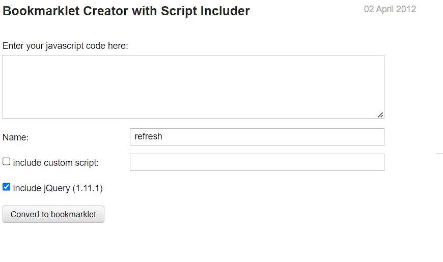
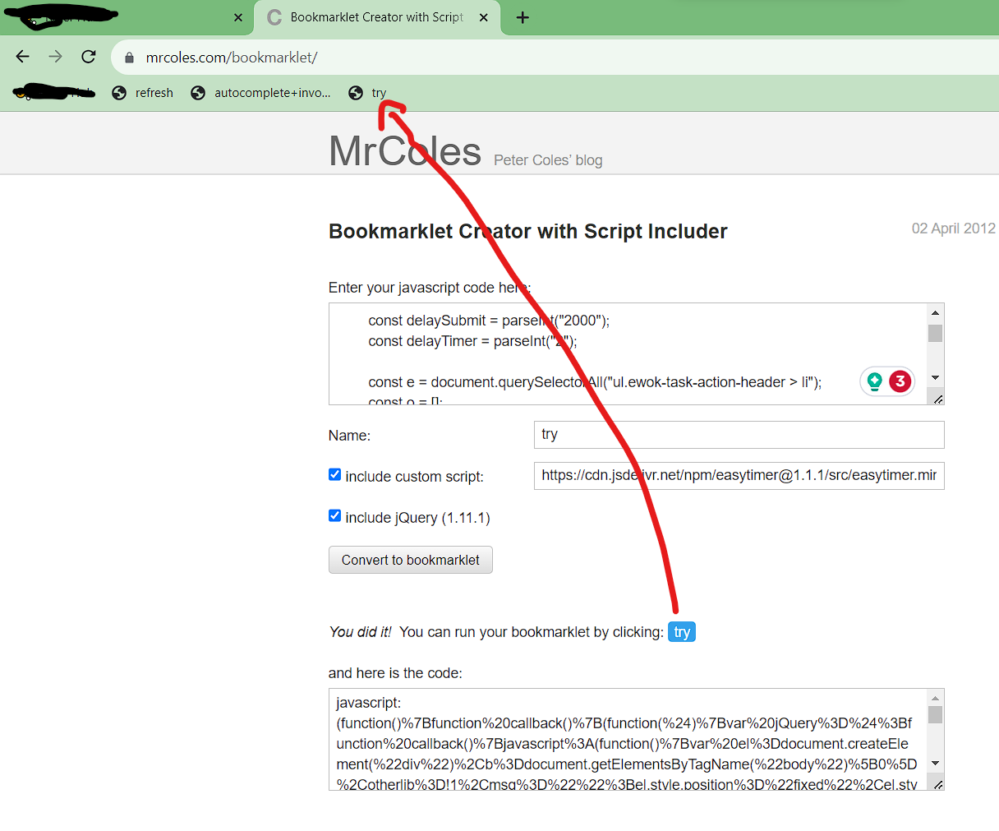

# Yukon Scripts Bookmarklet

This project contains a series of bookmarklet scripts that can be used on the Yukon project to automate tedious tasks that take up a lot of time and do not allow you to concentrate on your work.

Note: These are not official scripts, use them at your own risk. Although these scripts allow you to automate a number of repetitive tasks, always check your work to perform at your best and avoid quality audits.

## What's new

We will provide a brief summary of the newly added features:

* Refresh Page & Auto-Acquire new tasks
* Autocomplete & autosubmit tasks

## What it includes

This is the list of all the available scripts:

1. Refresh Page and Auto-Acquire new tasks
2. Autocomplete & autosubmit tasks

## Run the scripts

First of all, the bookmarks bar must be made visible in Google Chrome. To do this, simply go to Settings > Appearance > Show bookmarks bar.
For more information, please consult this link [Click](https://www.howtogeek.com/415733/how-to-show-or-hide-the-google-chrome-bookmarks-bar/).

Then to create a bookmarklet go to this page [MrColes](https://mrcoles.com/bookmarklet/) you will something like this

In "Enter your javascript code here:" just copy & paste a script from
[refresh_page.js](https://github.com/Sopralapanca/sopralapanca.github.io/blob/master/refresh_bookmarklet.js) or [autocomplete_bookmarklet.js](https://github.com/Sopralapanca/sopralapanca.github.io/blob/master/autocomplete_bookmarklet.js)

Give it a name that you want like "refresh" or "autosubmit".

Check the field **'include jQuery 1.11'** and for the autocomplete script also tick the field **'include custom script'** and insert this link https://cdn.jsdelivr.net/npm/easytimer@1.1.1/src/easytimer.min.js

Finally click on Convert to bookmarklet and a blue box will appear on the page

You can then drag the little blue box that has the name you’ve given the bookmarklet to your bookmark bar and you are done as is shown on the image above.
Each time you are on the task homepage click on the "refresh" bookmarklet to start refreshing the page in search of tasks, each time you acquire a task click on the "autocomplete" bookmarklet to autocomplete the task and auto-submit it when time expires.

## How it works

Remember that the bookmarks bar must be made visible in Google Chrome. Each time you need to execute a script just click on the desired bookmark.

### Refresh and Autoacquire
This script will refresh the homepage every 60 seconds in search of tasks. When a new task appears, a sound notification will be played and the task will be opened in a new tab.
In the event that more than one button appears, the first one in the list will be acquired, and in the event that there are buttons labelled "adult/upsetting/offensive", priority will be given to these which will be acquired first.
In the event that the automatic warning for too many page refreshes pops up, simply ignore it and tick the chrome box to stop the messages from appearing.

### Autocomplete and Autosubmit
Once you have acquired the task, you can use this script to automate the sending of the task when time runs out and to autocomplete certain tasks.
This script in particular:
* Set tasks with sliders to a specific default value,
* Set some checkboxes and radio buttons in the most common way,
* Opens some links in the browser although it is **STRONGLY RECOMMENDED TO OPEN THE LINKS FROM THE PHONE** to give the best possible rating and avoid mismatches between web and mobile version of the page.

## Donation
If you would like to support the work, please consider a donation by clicking the button below. Your help is really important to us and motivates us to continue the work. If you want to be included in the list of donators who supports the projects, please leave a nickname as a message when donating.

 

List of donators:
* MoonShadow
* StarGazer
* ThunderStrike

## Search for contributors
Unfortunately, the development of this script takes a long time since it has to be tested for each new task that is inserted, and since I am not a pro developer with javascript. Anyone who wants to help with the development is welcome and for any information you can contact me at email giacomo__95@hotmail.it

## Known Bugs

* When using autocomplete script to complete a task with slider bars and there are two (or more) sliders side by side (like Needs Met and Page Quality), if a click is done to change the value of a slider the hidden value of the other slider will be resetted to zero, so when the task is sent an error will pop up as if the slider has not been set correctly even though visually it is set. Just click on the desired value and resend the task.

* When using autocomplete scripts, results link will be opened in a new tab and some of them will be closed automatically at the end of the task, some of them will be not closed.

* When using refresh script, if a task appears and is acquired, but expires immediately after being acquired, the homepage will be opened in a new tab, simply click on the refresh bookmarklet to restart the script.

* For autocomplete script, task are added one by one, there may be the case that two tasks are similar and may cause overlapping when autocompleted

* Tested only for italian locale, there may be tasks in your locale that are not present in the Italian one or that are slightly different
